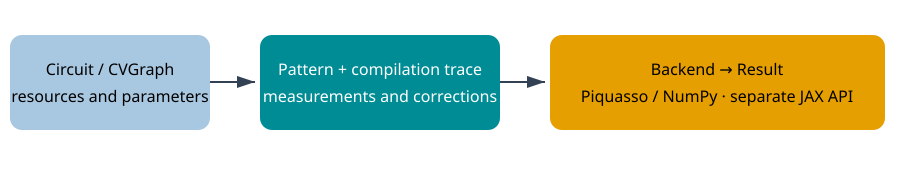

# Architecture

CVGraph describes labelled resources. Pattern is the causal command IR. Circuit lowers gates into Pattern, while CompilationTrace records source provenance. Capability preflight checks complete preparation requirements before backend allocation. Backends execute trajectories and export independent state snapshots. Analysis and independent references must not simply call the production path they validate. Mixed Fock is a separate backend; JAX execution has a distinct estimator contract.

See [numerical policy](../validation/numerical-policy.md), [API](../api/index.md) and the [feature matrix](../validation/feature-matrix.md).
