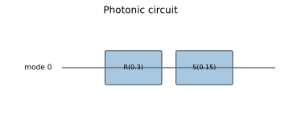
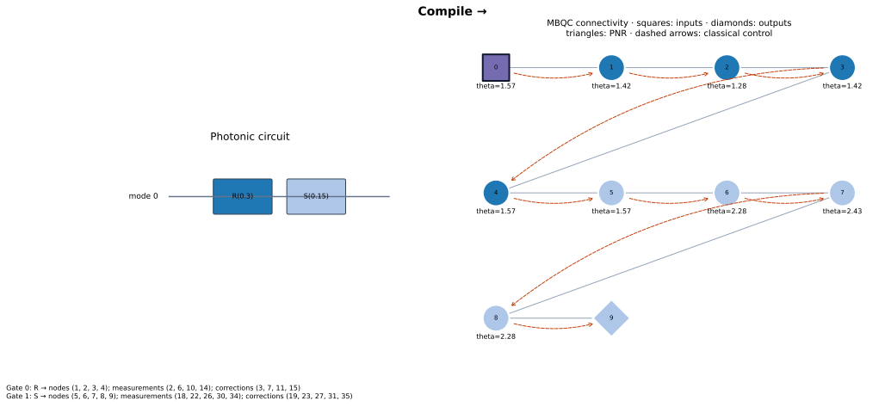
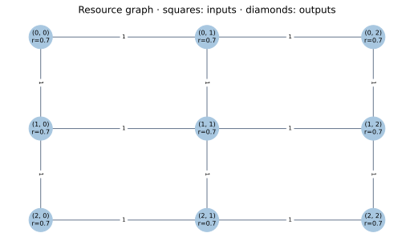
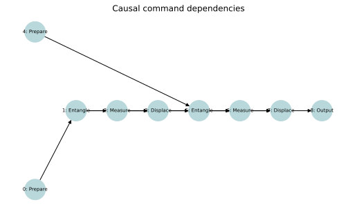
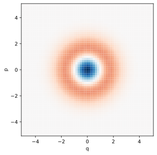
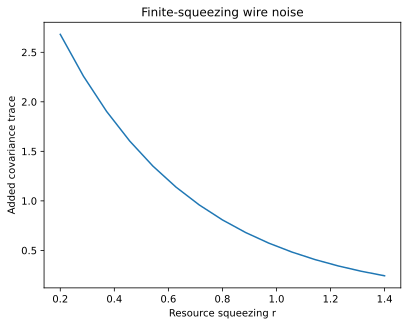
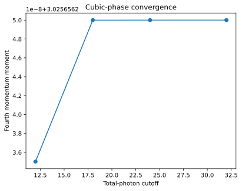

# Gallery

All figures are generated from this package by `scripts/generate_docs_figures.py`.

## Photonic circuit and MBQC correspondence

Colors associate source gates with generated resource nodes; the table records
measurements and corrections. The finite resource adds physical noise.

## Resource and classical dependencies

The cluster graph describes entangling connectivity. The command DAG describes
causal execution; it is not itself a flow certificate.

## Non-Gaussian phase space

The central negative region is a quasiprobability feature, not a negative event rate.

## Physical and numerical limits

Squeezing changes the physical resource. Cutoff changes numerical representation.
The two curves answer different questions and should not share an error budget.
