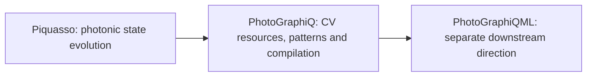

# PhotoGraphiQ

**Build, simulate and understand continuous-variable photonic MBQC in Python.**

PhotoGraphiQ connects optical circuits to weighted cluster resources, adaptive
measurements and classical feed-forward. It lets you ask what state survives a
measurement pattern, how finite squeezing changes a computation, and whether a
non-Gaussian result has converged with Fock cutoff.

## Start with an experiment

[Install from source](getting-started/installation.md), then follow the
[five-minute quickstart](getting-started/quickstart.md). You will prepare an input,
measure a cluster, inspect the output and draw the computation. No symplectic
algebra is required to begin.

## Where this package fits

Use raw Piquasso when an optical instruction sequence is your natural model.
Use PhotoGraphiQ when the computation is a labelled resource graph with adaptive
measurement dependencies, reusable parameters and MBQC corrections. The package
adds scheduling, compilation provenance, conventions and validation around the
simulator. PhotoGraphiQML is a downstream direction, not a required dependency.

In CV-MBQC, continuous quadratures of optical modes carry information. Entangled
resource states supply connections; measurements and outcome-dependent corrections
carry out the computation. Finite squeezing produces physical noise and filtering.

## Choose your path

| Use the package | Understand or extend it |
|---|---|
| [Quickstart](getting-started/quickstart.md) | [Conventions](getting-started/conventions.md) |
| [Inputs](user-guide/inputs.md) and [outputs](user-guide/outputs.md) | [Theory](theory/index.md) |
| [Tutorials](tutorials/index.md) and [projects](examples/index.md) | [Architecture](development/architecture.md) |
| [API reference](api/index.md) | [Validation](validation/index.md) |

## Research status

The Gaussian and v0.2 pure-Fock core have independent validation evidence.
v0.3 adds experimental mixed-state evolution, a Gaussian-plus-cubic compilation
target with approximate quartic/Kerr synthesis, finite-energy GKP resources, and
optional differentiable finite-Fock execution. Consult the
[feature matrix](validation/feature-matrix.md) before choosing a backend.

Graphix checks MBQC **structure**: labels, edges, measurement order and classical
dependencies. It does not validate continuous-variable amplitudes or quadrature
statistics. [Learn about the validation stack](validation/index.md).
