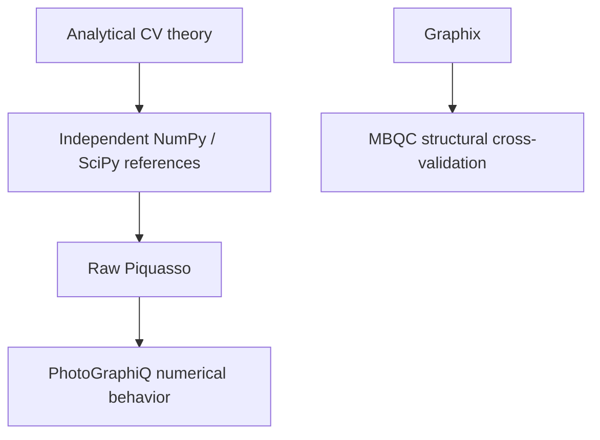

# Validation philosophy

Different comparisons answer different questions. Gaussian backends share a
measurement adapter, so agreement between them alone does not independently
validate detector statistics. Analytical moments and density integrals supply
that evidence. Graphix checks labels, edges, order and correction domains; it is
never a continuous-variable numerical oracle.

The [v0.2 hardening report](../release-hardening-report.md) records historical
Windows/Linux evidence. New mixed-state, synthesis, GKP and differentiation paths
have separate tests and remain experimental. A configured CI workflow is not a
passing run. Local checks and remote checks must be reported separately.

See the [feature matrix](feature-matrix.md), [numerical policy](numerical-policy.md),
and [detailed historical validation](../validation.md).
